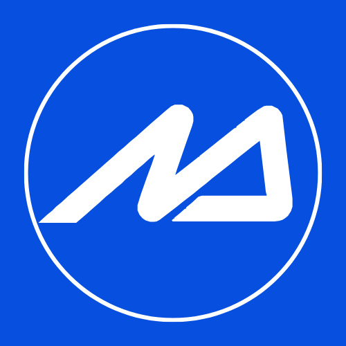
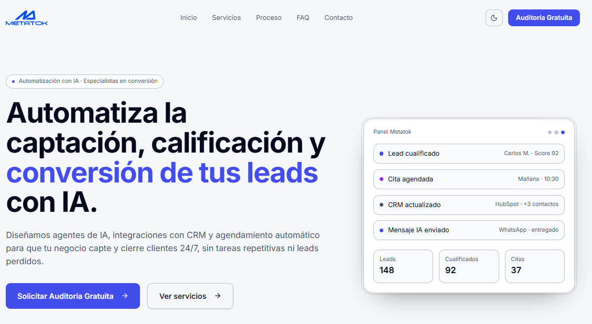

  

  # Metatok - Automatización con IA

  **Plataforma experta en el diseño de ecosistemas de Inteligencia Artificial Conversacional.**
   
  Captamos, cualificamos y convertimos leads 24/7 sin tareas repetitivas.

 

## 🚀 Sobre el Proyecto

Metatok es una landing page premium, dinámica y moderna diseñada para una agencia especializada en IA y automatización. Su objetivo es transmitir innovación, autoridad y eficiencia a través de una experiencia de usuario (UX) impecable y una interfaz visual (UI) de alto impacto.

### 🌟 Características Principales

*   **Diseño "Flat Premium"**: Una estética pulida con colores índigo y violeta vibrantes que se adaptan automáticamente a las preferencias de sistema del usuario.
*   **Tema Claro y Oscuro Inteligente**: Soporte completo para light/dark mode con persistencia local y transiciones suaves, incluyendo un efecto "glow" de orbes animados dinámicos adaptables al tema.
*   **Animaciones Avanzadas**: Implementación de revelado de elementos, staggered lists y typing effects con `Framer Motion` y `Anime.js` para una experiencia inmersiva.
*   **Responsive Extremo**: Optimizada para dispositivos móviles, eliminando scroll horizontal y garantizando que el diseño respire y fluya correctamente en cualquier resolución.
*   **Sección de Precios Interactiva**: Sistema de tarjetas de planes con animaciones físicas (spring physics), insignias "glassmorphism" y toggle entre facturación mensual, trimestral y anual.
*   **Marquee de Marcas de Confianza**: Carrusel infinito y fluido de logotipos integrados orgánicamente con efectos de escala de grises.
*   **SEO Técnico**: Metadatos completos implementados (Open Graph, Twitter Cards, Schema.org JSON-LD).

## 🛠️ Tecnologías Utilizadas

*   **Framework**: [React](https://reactjs.org/) + [TanStack Start (SSR)](https://tanstack.com/start/latest)
*   **Estilado**: [Tailwind CSS](https://tailwindcss.com/)
*   **Animaciones**: 
    *   [Framer Motion](https://www.framer.com/motion/)
    *   [Anime.js](https://animejs.com/)
*   **Iconografía**: [Lucide React](https://lucide.dev/)
*   **Componentes UI**: Inspirados en [Radix UI](https://www.radix-ui.com/) y patrones de diseño modernos.

## 📱 Secciones de la Web

1.  **Hero**: Propuesta de valor clara, llamadas a la acción primarias y visualización en mockups con orbes flotantes reactivos al tema.
2.  **Confianza (Marcas)**: Carrusel infinito de clientes/partners.
3.  **Servicios**: Tarjetas modulares de alto contraste detallando cada solución (CRM, Chatbots, Voicebots, Flow-works).
4.  **Flujo / Proceso**: Explicación paso a paso de cómo se integra Metatok en un negocio.
5.  **Planes y Precios**: Estructura de tiers con cálculo dinámico de ahorro según el ciclo de facturación.
6.  **FAQ**: Preguntas frecuentes organizadas de forma limpia.
7.  **Contacto (Auditoría)**: Formulario de captación de leads conectado para la auditoría gratuita.
8.  **Footer**: Enlaces de interés, redes sociales y branding final.

---

  <i>Diseñado y desarrollado para maximizar la conversión y la percepción de marca.</i>

